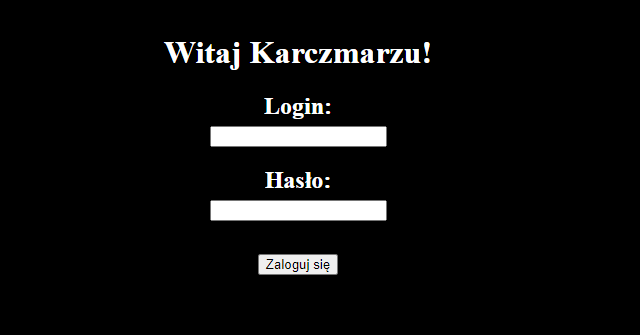
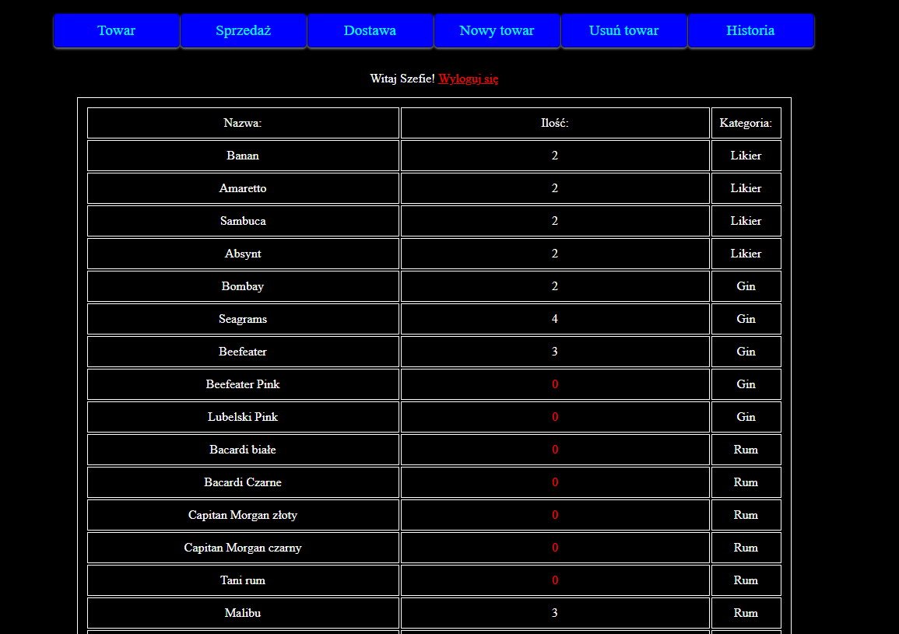
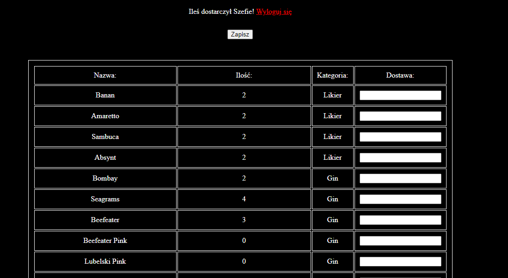
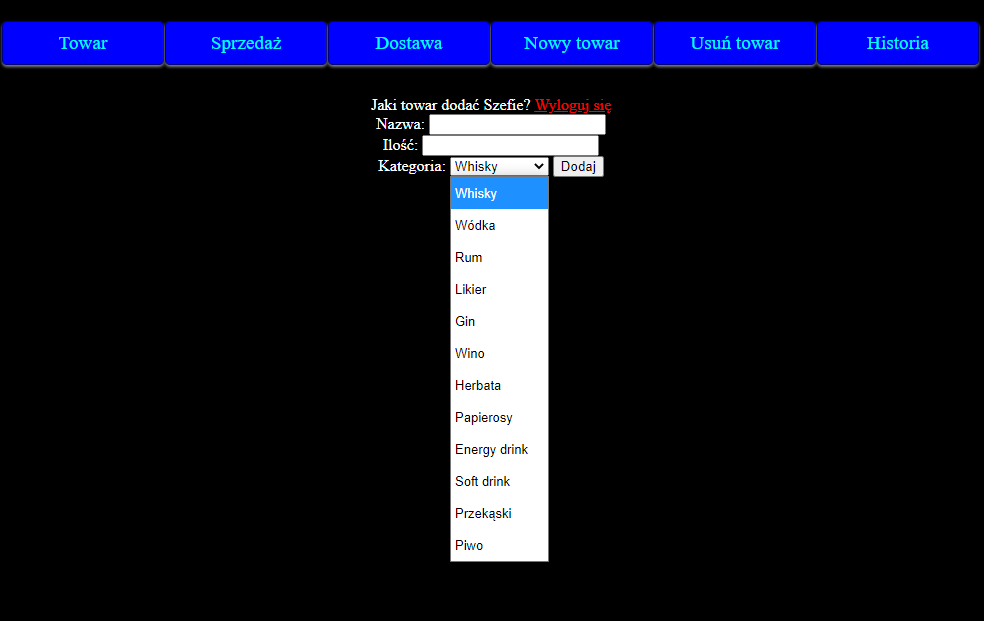
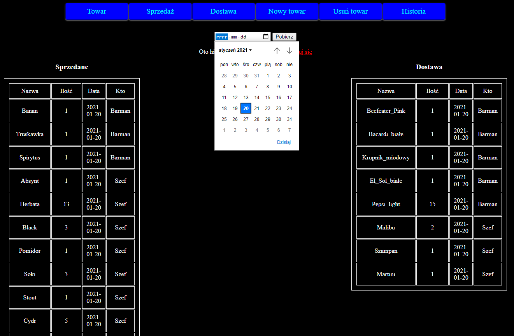

# Table of contents
* [General info](#general-info)
* [Technologies](#technologies)
* [Features](#Features)
* [Web adress](#web-adress)
## General info
This project is simple Virtual Conference Portal.
	
## Technologies
Project is created with:
* HTML5
* CSS3
* JavaScript
* Php
* SQL
	
## Features
* Login 

* List of items

* Delivery and sale

* Add and remove product

* History

